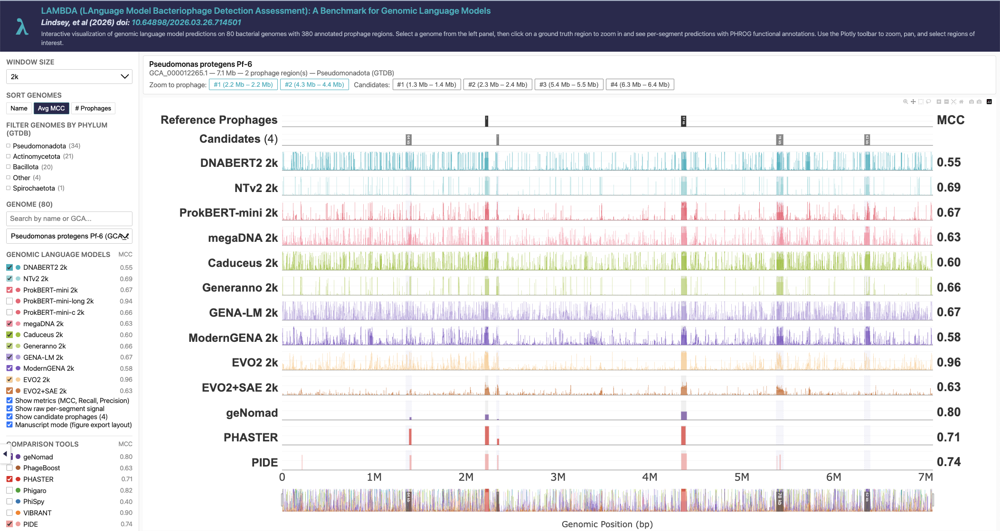

# LAMBDA: A Prophage Detection Benchmark for Genomic Language Models

LAMBDA is a benchmark and toolkit for **prophage detection** with genomic language models (gLMs). Prophages, which are bacteriophage genomes integrated into their bacterial hosts, have no universal sequence signature, so recovering them across a whole genome is a stringent test of whether a DNA language model has learned transferable, sequence-level features rather than local motifs. LAMBDA evaluates gLM embeddings on phage versus bacteria discrimination across four categories of increasing difficulty: linear and nonlinear probing, fine-tuning, diagnostic controls, and genome-wide prophage detection.

- **For genomic language model developers:** LAMBDA is a diagnostic benchmark rather than a single leaderboard number. It separates embedding quality (using linear and nonlinear probes) from fine-tuned accuracy, and has dedicated controls to expose GC-content and compositional bias. It also breaks performance down by bacterial host taxonomy and viral lineage so you can see which sequences a model fails on, and compares every gLM against simple feature baselines (GC, k-mer) as well as against established prophage tools (geNomad, PHASTER, VIBRANT).
- **For researchers annotating bacterial genomes:** LAMBDA provides pre-trained genomic language models trained to identify prophage on any set of bacterial genomes. We also provide an interactive visualizer to compare prophage-prediction tools side by side (gLMs alongside geNomad, PHASTER, VIBRANT), a consensus view of regions predicted by multiple tools, and PHROG functional annotation of predicted prophage genes. Currently, the visualization tool shows the genome-wide prophage detection on the test dataset used in the LAMBDA manuscript. The visualizer can be set up to visualize prophage in any dataset by any model. Instructions to set this up on your own dataset is provided in a separate repository [leannmlindsey/lambda-benchmark](https://github.com/leannmlindsey/lambda-benchmark).

### ▶ Explore the interactive benchmark → [leannmlindsey.github.io/lambda-benchmark](https://leannmlindsey.github.io/lambda-benchmark/)

[](https://leannmlindsey.github.io/lambda-benchmark/)

## Abstract

Transformer-based genomic sequence models represent an emerging frontier in computational biology. Yet, their embeddings have not yet shown the same level of predictive power as natural and protein language models, indicating a gap between current implementations and theoretical promise. Existing benchmarks for DNA language models primarily focus on classifying regulatory elements in eukaryotic genomes, leaving open the fundamental question of whether these models learn sequence-level features across whole genomes. We introduce LAMBDA, a benchmark designed to rigorously evaluate genome language model embeddings through phage-bacteria sequence discrimination across four categories of increasing complexity: probing tasks, fine-tuning assessments, diagnostic tests, and genome-wide prophage detection. Our comprehensive analysis of current genomic language models provides novel insights into the importance of training data quality relative to model size, the need for domain-specific training, and the application of genomic language models for detecting prophage sequences. This benchmark represents a challenging genomic annotation task in the bacterial domain and addresses a key computational problem with direct relevance to microbiology and medicine.

## Repository Layout

This repository contains the code to **reproduce the LAMBDA benchmark end-to-end**:

| Directory | Purpose |
|-----------|---------|
| [`replication/`](replication/) | End-to-end pipeline: download data + checkpoints from Zenodo → run inference for all models × 3 categories → aggregate into the website JSON format. **Start here to reproduce paper results or run LAMBDA on your own data.** |
| [`inference/`](inference/) | Per-model inference scripts — run a CSV of DNA sequences through a trained checkpoint and get predictions. One subdirectory per model. |
| [`dataset_creation/`](dataset_creation/) | Scripts that build the LAMBDA dataset from GTDB + INPHARED source data (segment extraction, prophage filtering, BLAST cross-validation, train/dev/test splits). |

**For model training and fine-tuning**, see the per-model upstream repositories listed below. The `inference/` directory here contains *only* the files needed to run a trained model on the LAMBDA evaluation splits; the upstream repos contain the training pipelines, embedding-analysis code, and full documentation.

## Interactive Results

Explore and compare all model results on the LAMBDA benchmark:
[https://leannmlindsey.github.io/lambda-benchmark/](https://leannmlindsey.github.io/lambda-benchmark/)

Source for the dashboard: [leannmlindsey/lambda-benchmark](https://github.com/leannmlindsey/lambda-benchmark).

## Download the Dataset

The LAMBDA benchmark dataset is available on Zenodo. The link below is the **concept DOI** ("cite all versions"), which always resolves to the latest version:
[https://doi.org/10.5281/zenodo.19236552](https://doi.org/10.5281/zenodo.19236552)

### Zenodo deposit layout

The deposit contains three archives: the dataset **`LAMBDA_v1.tar.gz`**, the aggregated results table **`LAMBDA_v1_results.tar.gz`**, and the model checkpoints **`lambda_best_checkpoints.tar.gz`** (described below). `LAMBDA_v1.tar.gz` unpacks to `LAMBDA_v1/`, with all segments **pre-computed at 2k, 4k, and 8k** context windows — no segmentation step is required to run a model.

| Path | Description |
|------|-------------|
| `train_val_test/{2k,4k,8k}/{train,val,test}.csv` | Phage-vs-bacteria classification splits at each window size (`segment_id, sequence, label, source`) |
| `genome_wide/{2k,4k,8k}/<assembly>_genomic_segments.csv` | Pre-segmented whole-genome test set (80 genomes), with per-window ground-truth labels (`seq_id, start, end, sequence, label, in_prophage, prophage_start, prophage_end`) |
| `fpr_test/{2k,4k,8k}/` | Bacteria-only segments (false-positive-rate control) |
| `fnr_test/{2k,4k,8k}/` | Phage-only segments (false-negative-rate control), plus `fnr_test/2k/phage_annotated_segments_2k.csv` for the PHROG functional-category analysis |
| `shuffled_controls/{2k,4k,8k}/test_shuffled.csv` | GC-preserving shuffled control (GC-bias diagnostic) |
| `metadata/prophage_reference_locations.csv` | Ground-truth prophage locations (`NCBI Id, Assembly, start, end, Organism Name, Publication`) |
| `metadata/gtdbtk.bac120.summary.tsv` | GTDB-Tk taxonomy per assembly |
| `metadata/{phage,bacteria}_accessions/`, `pipeline_version.txt`, `checksums.md5` | Accession lists, dataset version, and file checksums |

**Results table.** `LAMBDA_v1_results.tar.gz` contains `LAMBDA_v1_results.csv` — the master results table behind the paper's summary tables (one row per model × window, with linear-probe, 3-layer-NN, fine-tuned, diagnostic, and genome-wide metrics) — plus a column data dictionary.

**Model checkpoints.** The **EVO2 and EVO2+SAE weights are provided on Zenodo** (`lambda_best_checkpoints.tar.gz`). Both are zero-shot, so this archive ships only the small trained EVO2 probe heads (linear probe + 3-layer NN, with scalers, per window) and a pointer to the EVO2+SAE scoring code; the base models are obtained from their upstream repos (Arc's [evo2](https://github.com/ArcInstitute/evo2) and [Evo2_SAE_LAMBDA_assessment](https://github.com/leannmlindsey/Evo2_SAE_LAMBDA_assessment)). All other model checkpoints — fine-tuned ProkBERT, NT v2, GENERanno, Caduceus, DNABERT-2, GENA-LM, and ModernGENA — are **available from the authors on request**; otherwise fine-tune each from the `train_val_test/` splits using its [training repository](#models-benchmarked).

## Models Benchmarked

The following genomic language models were evaluated on LAMBDA. The `inference/<model>/` subdirectory contains the inference-only scripts; the upstream repo contains the training pipeline.

| Model | Inference (this repo) | Training repository |
|-------|----------------------|---------------------|
| DNABERT-2 | [`inference/dnabert2/`](inference/dnabert2/) | [DNABERT2_generic_sequence_classification](https://github.com/leannmlindsey/DNABERT2_generic_sequence_classification) |
| Nucleotide Transformer v2 | [`inference/nucleotide_transformer_v2/`](inference/nucleotide_transformer_v2/) | [NTv2_generic_sequence_classification](https://github.com/leannmlindsey/NTv2_generic_sequence_classification) |
| Caduceus | [`inference/caduceus/`](inference/caduceus/) | [Caduceus_generic_sequence_classification](https://github.com/leannmlindsey/Caduceus_generic_sequence_classification) |
| ProkBERT | [`inference/prokbert/`](inference/prokbert/) | [ProkBERT_generic_sequence_classification](https://github.com/leannmlindsey/ProkBERT_generic_sequence_classification) |
| megaDNA | [`inference/megadna/`](inference/megadna/) | [megaDNA](https://github.com/leannmlindsey/megaDNA) |
| GENERanno | [`inference/generanno/`](inference/generanno/) | [Generanno_generic_sequence_classification](https://github.com/leannmlindsey/Generanno_generic_sequence_classification) |
| EVO2 | [`inference/evo2_sae/`](inference/evo2_sae/) | [evo2](https://github.com/ArcInstitute/evo2) (Arc Institute) |
| EVO2+SAE | [`inference/evo2_sae/`](inference/evo2_sae/) | [Evo2_SAE_LAMBDA_assessment](https://github.com/leannmlindsey/Evo2_SAE_LAMBDA_assessment) |
| GENA-LM | [`replication/new_model/`](replication/new_model/) | [GENA_LM_generic_sequence_classification](https://github.com/leannmlindsey/GENA_LM_generic_sequence_classification) |
| ModernGENA | [`replication/new_model/`](replication/new_model/) | [GENA_LM_generic_sequence_classification](https://github.com/leannmlindsey/GENA_LM_generic_sequence_classification) |

## What this repository supports

The scripts in [`replication/`](replication/) document three distinct workflows. Each shares the same pipeline; what differs is which steps you run.

### 1. Reproduce the manuscript results

Download the LAMBDA dataset + fine-tuned checkpoints from Zenodo, run inference for all models across all LAMBDA splits, and aggregate into the per-genome JSON files consumed by the [dashboard](https://leannmlindsey.github.io/lambda-benchmark/).

```bash
cd replication
cp paths.env.template paths.env && vim paths.env   # set 4 directories
bash 01_download_zenodo.sh                          # dataset + fine-tuned checkpoints
bash 02_submit_inference_jobs.sh                    # SLURM jobs for every model × category × window
python 03_build_website_data.py \
    --predictions ${RESULTS_ROOT} \
    --ground-truth ${DATASET_ROOT}/metadata/prophage_reference_locations.csv \
    --taxonomy ${TAXONOMY_CSV} \
    --output ${RESULTS_ROOT}/aggregated
```

### 2. Evaluate a new genomic language model on LAMBDA

Fine-tune your new gLM on the LAMBDA training split, run inference on the test split, and use the same aggregator the published models use. The [`replication/new_model/`](replication/new_model/) directory provides templates that work for any HuggingFace `AutoModelForSequenceClassification`-compatible model (GENA-LM, DNABERT-2, NT-v2, ProkBERT, HyenaDNA, GENERanno, etc.).

```bash
cd replication/new_model
vim run_finetune.slurm     # set MODEL_NAME (e.g., AIRI-Institute/gena-lm-bert-base-t2t), DATASET_DIR
sbatch run_finetune.slurm

vim run_inference.slurm    # set MODEL_PATH (to the fine-tuned checkpoint)
sbatch run_inference.slurm

cd ..
python 03_build_website_data.py --predictions ${RESULTS_ROOT} --output ${RESULTS_ROOT}/aggregated
```

See [`replication/new_model/README.md`](replication/new_model/README.md) for a worked GENA-LM example and the table of supported model families.

### 3. Predict prophages in your own bacterial genomes

Use the published fine-tuned checkpoints to find prophages in your own FASTAs. Step `00_segment_fasta.py` slides 2k/4k/8k windows across each contig; the rest of the pipeline runs as in case 1.

```bash
python 00_segment_fasta.py \
    --fasta-dir /path/to/your/bacterial_fastas \
    --output-root ${DATASET_ROOT} \
    --windows 2k 4k 8k
bash 02_submit_inference_jobs.sh
python 03_build_website_data.py --predictions ${RESULTS_ROOT} --output ${RESULTS_ROOT}/aggregated
# Optional: bash 04_annotate_predicted_prophages.sh    # PHROG annotations via Pharokka
```

See [`replication/README.md`](replication/README.md) for full step-by-step instructions for all three use cases, including environment setup, CSV schemas, and how to view the dashboard locally.

Under the hood, each step calls the per-model scripts in [`inference/<model>/`](inference/). If you want to run a single model in isolation (without the orchestrator), each subdirectory has its own README with a working quick-start command.

## Help expand the benchmark

We are actively growing the genome-wide test set for future versions of LAMBDA. **If you have experimentally confirmed or well-curated prophage locations in bacterial genomes, we would love to include them.** Please email a link to the relevant publication or dataset to [leannmlindsey@gmail.com](mailto:leannmlindsey@gmail.com), and we will consider it for the next release. Higher-quality, more diverse ground truth makes the benchmark better for everyone.

## Authors

Leann M. Lindsey, Nicole L. Pershing, Keith Dufault-Thompson, Ho-jin Gwak, Anisa Habib, Aaron Schindler, Arjun Rakheja, June Round, W. Zac Stephens, Anne J. Blaschke, Hari Sundar, Xiaofang Jiang

**Affiliations:**
1. National Library of Medicine, National Institutes of Health, Bethesda, MD, USA
2. Kahlert School of Computing, University of Utah, Salt Lake City, UT, USA
3. Department of Pediatrics, School of Medicine, University of Utah, Salt Lake City, UT, USA
4. Department of Pathology, School of Medicine, University of Utah, Salt Lake City, UT, USA
5. Department of Computer Science, Tufts University, Medford, MA, USA
6. Division of Computer Engineering, Hankuk University of Foreign Studies, Yongin, Republic of Korea

## Citation

If you use LAMBDA in your research, please cite our preprint:

> Lindsey, L. M., Pershing, N. L., Dufault-Thompson, K., Gwak, H., Habib, A., Schindler, A., Rakheja, A., Round, J., Stephens, W. Z., Blaschke, A. J., Sundar, H., & Jiang, X. (2026). *LAMBDA: A Prophage Detection Benchmark for Genomic Language Models.* bioRxiv. https://doi.org/10.64898/2026.03.26.714501

## License

See [LICENSE](LICENSE) for details.
